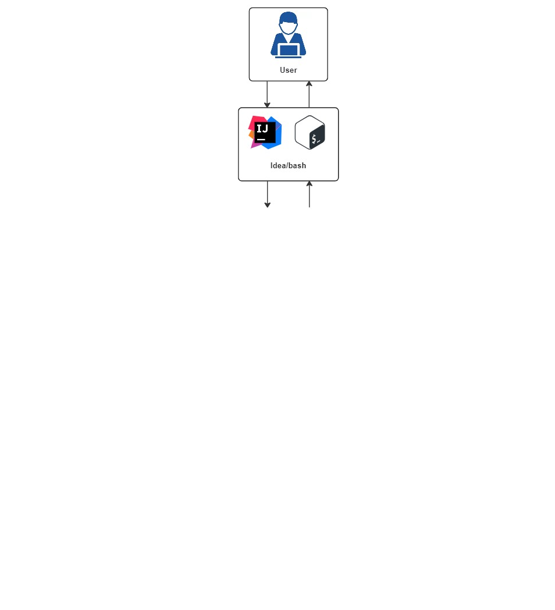

# Homework Y_LAB: Training Diary
> Приложение для ведения дневника тренировок. Скоро лето и еще не поздно привести себя в порядок! Данное приложение
> поможет вам нагнать темп и следить за своим здоровьем. Записывайте свои тренировки, чтобы анализировать свой прогресс.
> И помните, что главное - это регулярность.

1. [Link PR №1](https://github.com/Jon7even/homework_ylab/tree/main/homework_1) 

> [!IMPORTANT]
> Создано с помощью:
> - Java 17
> - JUnit 5
> 

> [!NOTE]
> Что это? Это консольное приложение для тренировок. На данный момент не поддерживает хранение данных при 
> прерывании/отключении процесса java. А при включении начинается все сначала. Но если у вас случайно завалялся 
> старый компьютер, который имеет хотя бы 1Gb памяти, на него можно установить Linux и включить наше приложение. 
> Желательно подключение делать через ИБП (надеемся свет у вас не так часто отключают). Но спешим обрадовать! Еще пару 
> бессонных ночей и мы сможем перевести этот проект на реальную базу данных.
>

## Архитектура приложения

> [!TIP]
> Что можно улучшить:
> - перевести на микросервисную архитектуру
> - перевести на Spring Boot
> - подключить БД
> 

## Сборка и запуск
1. С помощью Maven собрать проект `mvn clean install` (проект соберется и запустятся автоматические тесты)
2. Запустить можно двумя способами: 
   2.1. В среде разработки IntelliJ IDEA
   2.2. Запустить собранный jar из папки `target` командой `java -jar training-diary-1.0-SNAPSHOT`
Работа приложения проверена на Windows 10 и Ubuntu 22.04.4.
